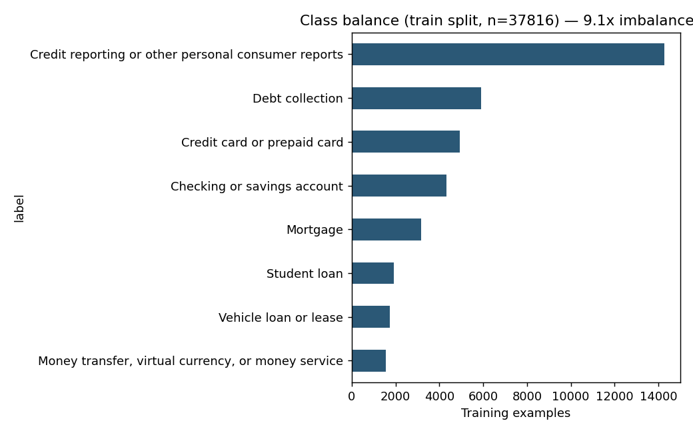
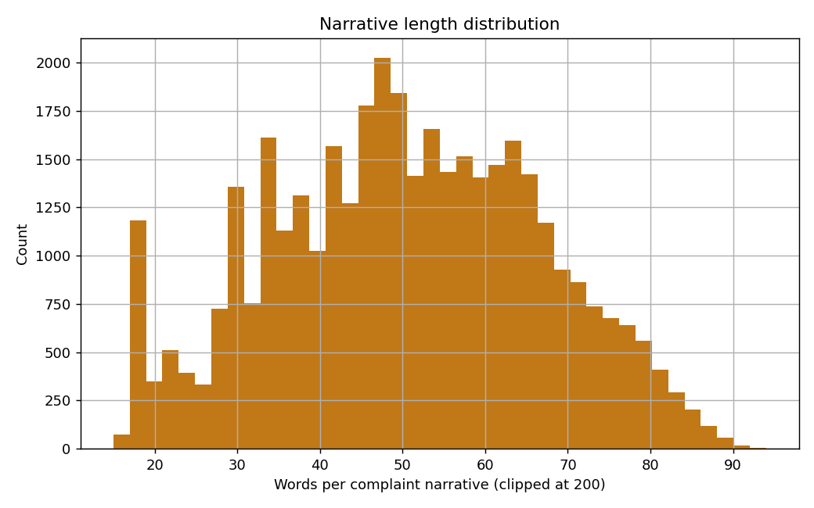

# EDA Summary — Phase 0

Generated from `data/processed/train.csv` (n=37816).

## Class balance

| Category | Train count | Share |
|---|---:|---:|
| Credit reporting or other personal consumer reports | 14273 | 37.7% |
| Debt collection | 5912 | 15.6% |
| Credit card or prepaid card | 4933 | 13.0% |
| Checking or savings account | 4325 | 11.4% |
| Mortgage | 3152 | 8.3% |
| Student loan | 1924 | 5.1% |
| Vehicle loan or lease | 1735 | 4.6% |
| Money transfer, virtual currency, or money service | 1562 | 4.1% |

Imbalance ratio (largest / smallest class): **9.1x**.

This is the collapsed 8-category label set (see `src/data/preprocess.py::LABEL_MAP`
for the full rationale). The raw CFPB `Product` field has 20+ overlapping
historical variants from taxonomy renames across years — those were
merged down to 8 categories, never across substantively different
products, so that every class still has enough examples to be learnable
(smallest class here is 1562 rows, ~4.1% of
train) while the total label space stays tractable for a portfolio
timeline. Credit reporting complaints dominate the real CFPB dataset
too — this mirrors that skew rather than flattening it, which is why
Phase 2 uses class-weighted loss instead of a naive fine-tune.

## Narrative length

- Median words/complaint: 50
- 5th/95th percentile: 21 / 78

## Label noise

Complaints go through `src/data/preprocess.py::collapse_labels`, which
maps the raw multi-year `Product` taxonomy onto the 8 canonical
categories. A portion of rows carry a raw `Product` value that's
inconsistent with the complaint content (CFPB's taxonomy has genuinely
been applied inconsistently across years — see project scope Section
4.1). This is not cleaned away before training: the point of the
class-weighted loss in Phase 2 and the macro-F1-driven promotion
criterion in Phase 3 is to be robust to exactly this kind of real-world
label noise, not to train against an artificially clean set.

